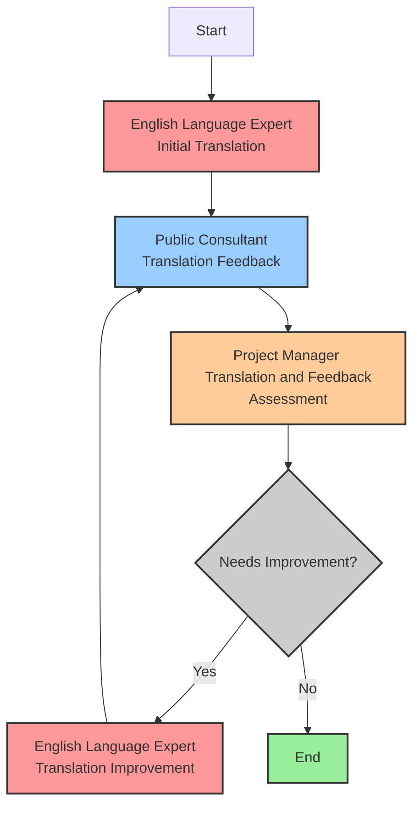

# Using GPT-4 for translating clinical trials texts to plain language for general public

## Introduction

This document details my experiment to use a  [Large Language model](https://en.wikipedia.org/wiki/Large_language_model), [GPT-4](https://openai.com/gpt-4) from [OpenAI](https://openai.com) in this case,  to translate clinical trials texts to plain language for general public.

My main objectives were to:
- Show how GPT-4 can help create accessible documents for the public.
- Explore if advanced prompting enhances translation quality.

Below, you'll find details on:

- The details of the process I used to generate the prompt under the heading [Prompting Process](#prompting-process)
- The final prompt: [prompt.md](prompt.md)
- Texts and translations from the presentation and the survey: [texts_and_translations.md](texts_and_translations.md)
- The GPT-4 output for all texts including the prompts, LLM's inner dialogs, and the final outputs: [outputs.html](https://erdemdemir.github.io/plainlanguage/outputs.html)
- My presentation to my colleagues  at Cambridge Cancer Trials Centre: [plainlang_presentation.pptx](plainlang_presentation.pptx) & [plainlang_presentation.pdf](plainlang_presentation.pdf)
- In addition to the presentation, I created a survey with paragraphs 1-5 in [texts_and_translations.md](texts_and_translations.md) hoping that I could capture how my colleagues would feel about it, but only 1 (one) person responded to the survey, so apart from thanking this unsung hero, I can't say much about the results.

## If you like try it yourself or get in touch

The free version of ChatGPT uses GPT-3.5. GPT-4 is far superior to GPT-3.5, but unfortunately a paid subscription is required to use it. If you like to try GPT-4 for free you can use [Microsoft Bing Chat](https://www.bing.com/search?q=Bing+AI&showconv=1&FORM=hpcodx) which uses GPT-4 under the hood. Another high quality free alternative is [Claude](https://claude.ai/login?returnTo=%2F).

If you have any questions or suggestions please get in touch using [Twitter](https://twitter.com/erdemdemir) or [LinkedIN](https://www.linkedin.com/in/rdmdmr/).

Erdem Demir

## Prompting Process

Instead of prompting the [GPT-4](https://openai.com/gpt-4) with a simple prompt like "Please translate the following technical clinical trials related text into plain language for general public." I utilised several more advanced techniques. I have been reading and using these techniques for some time but I haven't tried to measure their effectiveness objectively. The following process is mostly based on personal exposure, experience, and preferences:

- I generated 3 agents (personas) to interact with each other
  - An English Language Expert who is specialised in translating technical clinical trials texts to plain language
  - A Public Consultant to review translations from the Language Expert
  - A Project Manager to manage the translation process
- I also generated 4 workflows to be used by these agents
  - English Language Expert
    - Initial translation workflow
    - Translation improvement workflow
  - Public Consultant
    - Translation feedback workflow
  - Project Manager
    - Translation and feedback assessment workflow
- In addition to the agents and workflows, I added the following techniques
  - I gave the LLM an opportunity to think using the sentence "Take a deep breath and work on this task step by step"
  - I gave the LLM steps to follow when executing workflows
  - I gave the LLM examples to structure their response, like "1.Check if it would be helpful to provide some technical term translations in brackets, especially when the patient might be familiar with the technical name and it's in patient's interest to provide the the technical term, e.g., 'hypertension (high blood pressure)'."

